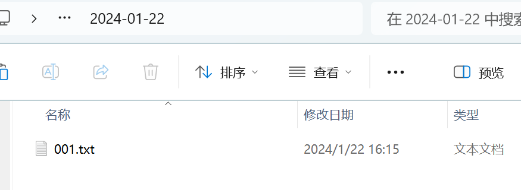

# 北醒雷达通用配置上位机

## 1 实现功能
实现北醒不同接口（UART、IIC、RS485）雷达的基本配置设置。
上位机实现功能如下：
> - 一键配置
> - 下拉复选框选择参数进行配置
> - 输入参数进行配置
> - 自动保存配置过程和检查结果到 txt 文件中
> - 通过选择JSON 文件，配置不同型号的雷达


## 2 使用步骤
### 2.1 选择 JSON 文件
- 点击文件菜单栏下的打开（快捷键：Ctrl + O），选择对应接口的 JSON 文件后，上位机会读取 JSON 文件里的数据并自动生成相应的界面。
- 通过连接不同的接口版本，选择不同的 JSON 文件，能够配置不同接口下的雷达配置。
（1）在文件标签选择打开

（2）进入json文件夹，根据当前雷达的通信协议选择文件夹


（3）根据雷达型号选择json文件

### 2.2连接和刷新串口
- 选择雷达对应的串口、波特率、接口版本后，点击连接按钮，若按钮显示已连接，则成功连接串口。
- 除此之外， 再次点击连接按钮即可断开连接，刷新按钮可对串口列表进行刷新。

- IIC或Modbus协议下，可以填写雷达从机地址，用于指令的生成，如果未填写或填写的地址不正确，在点击检查/设置时，程序会进行轮询扫描找到正确地址。


### 2.3 进行配置
- 按钮显示已连接后，点击请求/设置按钮可进行检查或配置参数，
- 配置流程与使用通用串口配置相同，如：设置某款雷达恢复出厂设置之后，点击保存配置生效。
- 


## 3 检查结果
### 3.1 自动保存方式
- 上位机每次打开进行配置时，会新建一个以当天日期命名的文件夹到运行软件的当前目录下。示例：

- 从打开软件进行配置到关闭软件会新建一个 txt文件，实时储存本次运行执行的命令。文件命名方式为数字序号。
 
- 文件内会记录每次点击设置时，相关的标签名、获取的值/输入的参数、设置结果、发送和接收的指令。
 


- 一键检查的结果保存在 txt 文件中的格式为：
> `标签名：（ 检查/输入的数据 ）  检查结果：（OK/NG）`
> `发送的指令：例“5A 04 11 6F”`
> `接收的指令：例“5A 05 11 00 70”`


## 4 各型号雷达配置差异
### 4.1 连接方式：
**硬件通信方式：**
不同的雷达支持的硬件通信方式各不相同，包含UART、RS485、RS232、IIC、CAN；
雷达通过TTL转USB、RS485/RS232转USB、USBCOM2I2C转接器、CAN分析仪等转换器与电脑连接，上位机使用指令进行数据处理、配置设置。

**通信协议：**

**1.UART**
代表5A开头的通用协议；
如：测距命令 5A 05 00 01 60
支持的硬件通信方式：UART、RS485、RS232；
支持型号：全型号。
**2.IIC**
对应基于USBCOM2I2C转接器的命令格式；
如：测距命令 53 20 05 5A 05 00 01 60 50 53 21 09 50
支持型号：TF-Luna 、TF-mini-s 、TF-mini-Plus、TF-02-Pro、TF-02-Pro-W。
**3.Modbus**
对应Modbus通信协议；
支持的硬件通信方式：UART、RS485、RS232；
如：测距命令 ：01 03 00 00 00 01 84 0A
支持型号：TFmini-i、TF02i、TF03。

### 4.2 输入参数配置
**1.帧率设置**：除了TF03以外，帧率设置需遵循“频率f=M/N,f取整数部分, M是最大频率,N∈正整数”，如最大频率为1000，则支持设置频率为：1000、500、333、200、166等，
TF03：


**2.I/O模式使能**：


根据命令格式进行输入，不同的参数用“空格”隔开，如设置为近高远低，临界值为100cm，滞回空间10cm，则输入为“1 100 10”。
**3.强度低阈值和输出**：
与I/O模式使能类似

示例：输入“100 1200”

### 4.3 不同硬件接口会出现的问题
#### 1.IIC硬件接口：
- 1.如果配置项会更改通信接口为UART，进行保存时收不到回显。会提示“NG”。
- 2.复位也收不到回显。会提示“NG”。
#### 2.RS485硬件接口：
- 1.RS485是半双工的，无法同时进行收发工作。处于5A通用协议下，并使用连续工作模式，指令的发送和接收容易出现问题。
### 4.4 不同型号雷达的特性：
#### 以下型号的雷达，都以TF-Mini-s为参考模板
**没有特殊说明的配置项均和TF-Mini-s一致**

#### TF-mini-s 
- 1.波特率、通信接口、恢复出厂设置等直接影响通信的配置需要**保存才会生效**；
- 2.不改变通信速率和方式的配置会**立即生效**，但需要点击保存才能储存配置，掉电不丢失；
- 3.**单次触发命令**，需要使能数据输出，并设置输出帧率为0，才可以使用。

#### TF-mini-plus 
- 1.**波特率修改会立即生效**，且收不到回显，报错“NG”，需要切换波特率后再进行保存才能完成修改，恢复出厂设置会导致波特率改变时，同理会报错“NG”，但不需要保存也会立即生效；
- 2.**修改通信方式会立即生效**，没有回显，报错“NG”，且不用保存即可完成更改。恢复出厂设置会导致通信方式改变时，同理会报错“NG”，且不需要保存也会立即生效；
- 3.IIC通信方式下，无法完成修改波特率，修改波特率后会导致接收不到数据，雷达不断电再重新上电无法恢复正常接收数据。

#### TF-02-Pro
- 1.特征与TF-mini-s 一致。
#### TF02-Pro-W
- 1.指令集中没有描述IO模式，因此未设置此功能。
#### TF03
- TF03有两个硬件版本分别是 UART-CAN和RS232-RS485，
UART-CAN版本并没有描述Modbus协议，但是可以进行使用。
- 1.**输出频率**：频率设置限制规则与其他型号不同

如：不能设置为0hz；
- 2.**单次触发命令**，与其他型号不同，需要先关闭输出，无需设置输出频率；
- 3.无法在Modbus协议下进行恢复出厂设置和设置工作模式，会返回报错指令；
- 4.**低功耗模式**使能后默认为1HZ，原指令5A 05 83 01 E3，回显为5A 05 83 00 E2，关闭低功耗模式原指令5A 05 83 00 E2，回显为5A 05 83 00 E2，但没有效果。恢复出厂设置能退出低功耗模式，且会立即生效不需要保存，掉电依旧生效。
- 5.**恢复出厂设置**会立即生效，如何此操作会导致波特率被修改，需要波特率切换至115200进行保存。
#### TF-MINI-I
- 1.切勿混用不同型号雷达的json文件，发送说明书中没有写明的指令可能导致雷达出现问题，如设置为IIC接口。
#### TF-02-I
- 1.切勿混用不同型号雷达的json文件，发送说明书中没有写明的指令可能导致雷达出现问题，如设置为IIC接口。
#### TF-Luna
- 1.**恢复出厂设置**无法收到回显，并且会直接生效，不需要保存；
- 2.**IIC连接模式**为硬件控制，没有****指令控制；
- 3.**修改波特率**，会直接生效，报错“NG”，并且需要保存才可生效。需要切换波特率，进行保存；
- 4.进入**超低功耗模式**后需连续发送多次退出指令，才能成功唤醒雷达接收回显指令。


## 附：上位机逻辑实现说明
### 1 JSON 文件说明
#### 1.1 JSON 文件介绍：
 
 
|  名称  | <div style="text-align: center">解释</div>                                                                                                                                                                                                  |
| :----: | :------------------------------------------------------------------------------------------------------------------------------------------------------------------------------------------------------------------------------------------ |
|   id   | 作为某项配置的标识，生成界面按照 id 值的顺序进行生成                                                                                                                                                                                            |
|  name  | 检查雷达某项配置的名称，如"序列号"，"固件版本"                                                                                                                                                                                                  |
| widget | 显示检查结果的组件类型（含有QLabel、QLineEdit、QComboBox三类，即检查值在标签上显示)                                                                                                                                                              |
|  cmd   | 检查雷达某项配置时需要发送的指令<br>- 若为空 ''，则根据name发送和解析命令<br>- 若不为空，则发送指令并接收回显进行判断                                                                                                                                |

以TF-Mini-S为示例

命令分为QLabel、QLineEdit、QComboBox三种类型，
1. QLabel：直接发送cmd中填写的指令。
2. QLineEdit：识别文本框中输入的值，并将解析出来的数据替换到cmd的指令中。
3. QComboBox：根据下拉选项框选择的选项序号，在多个命令中选择发送的命令。

程序内部根据标签名name在设置项对应的位置生成提示信息，以及判断回传的数据是否正确，并显示OK/NG提示回显正确或错误。

#### 1.2 不同通信协议下的说明
#####  UART：
**JSON 文件**
例：TF-Mini-S UART通用协议json文件
```json
[
    {"id": 0, "name": "序列号", "widget": "QLabel", "button": "请求", "cmd": "5A 04 12 70"},
    {"id": 1, "name": "固件版本", "widget": "QLabel", "button": "请求", "cmd": "5A 04 01 5F"},
    {"id": 2, "name": "单次触发指令", "widget": "QLabel", "button": "设置", "cmd": "5A 04 04 62"},
    {"id": 3, "name": "检查帧率", "widget": "QLabel", "button": "检查",  "cmd": ""},
    {"id": 4, "name": "输出帧率", "widget": "QLineEdit", "button": "设置", "cmd": "5A 06 03 LL HH SU"},
    {"id": 5, "name": "输出模式", "widget": "QComboBox", "button": "设置", "cmd": ["5A 05 05 01 65", "5A 05 05 02 66", "5A 05 05 06 6A", "5A 05 05 07 6B", "5A 05 05 08 6C", "5A 05 05 09 6D", "5A 05 05 0A 6E"]},
    {"id": 6, "name": "波特率", "widget": "QComboBox", "button": "设置", "cmd": "5A 08 06 H1 H2 H3 H4 SU"},
    {"id": 7, "name": "输出开关", "widget": "QComboBox", "button": "设置", "cmd": ["5A 05 07 01 67", "5A 05 07 00 66"]},
    {"id": 8, "name": "通信接口设置", "widget": "QComboBox", "button": "设置", "cmd": ["5A 05 0A 00 69", "5A 05 0A 01 6A"]},
    {"id": 9, "name": "修改I2C从机地址", "widget": "QLineEdit", "button": "设置", "cmd": "5A 05 0B ADDR SU"},
    {"id": 10, "name": "I/O模式使能", "widget": "QLineEdit", "button": "设置", "cmd": "5A 09 3B MODE DL DH ZoneL ZoneH SU"},
    {"id": 11, "name": "低功耗模式", "widget": "QLineEdit", "button": "设置", "cmd": "5A 06 35 0X 00 SU"},
    {"id": 12, "name": "强度低阈值和输出", "widget": "QLineEdit", "button": "设置", "cmd": "5A 07 22 XX LL HH 00"},
    {"id": 13, "name": "系统复位", "widget": "QLabel", "button": "设置", "cmd": "5A 04 02 60"},
    {"id": 14, "name": "恢复出厂设置", "widget": "QLabel", "button": "设置", "cmd": "5A 04 10 6E"},
    {"id": 15, "name": "保存", "widget": "QLabel", "button": "设置", "cmd": "5A 04 11 6F"}
   ] 
```
- 标准5A开头的串口通信协议，不考虑不同设备的ID地址。按照QLabel、QLineEdit、QComboBox三种类型，设置发送指令，按标签名以及发送的指令判断接收的数据是否正确。


##### IIC：

**JSON 文件**
例：TF-Mini-S IIC协议json文件

```json
[
    {"id": 1, "name": "I2C从机地址", "widget": "QLabel", "button": "检查" , "cmd": ""},
    {"id": 2, "name": "序列号", "widget": "QLabel", "button": "请求", "cmd": "5A 04 12 70"},
    {"id": 3, "name": "固件版本", "widget": "QLabel", "button": "请求", "cmd": "5A 04 01 5F"},
    {"id": 4, "name": "测距结果", "widget": "QLabel", "button": "设置", "cmd": ""},
    {"id": 5, "name": "输出帧率", "widget": "QLineEdit", "button": "设置", "cmd": "5A 06 03 LL HH SU"},
    {"id": 6, "name": "输出模式", "widget": "QComboBox", "button": "设置", "cmd": ["5A 05 05 01 65", "5A 05 05 02 66", "5A 05 05 06 6A", "5A 05 05 07 6B", "5A 05 05 08 6C", "5A 05 05 09 6D", "5A 05 05 0A 6E"]},
    {"id": 7, "name": "波特率", "widget": "QComboBox", "button": "设置", "cmd": "5A 08 06 H1 H2 H3 H4 SU"},
    {"id": 8, "name": "输出开关", "widget": "QComboBox", "button": "设置", "cmd": ["5A 05 07 01 67", "5A 05 07 00 66"]},
    {"id": 9, "name": "通信接口设置", "widget": "QComboBox", "button": "设置", "cmd": ["5A 05 0A 00 69", "5A 05 0A 01 6A"]},
    {"id": 10, "name": "修改I2C从机地址", "widget": "QLineEdit", "button": "设置", "cmd": "5A 05 0B ADDR SU"},
    {"id": 11, "name": "低功耗模式", "widget": "QLineEdit", "button": "设置", "cmd": "5A 06 35 0X 00 SU"},
    {"id": 12, "name": "强度低阈值和输出", "widget": "QLineEdit", "button": "设置", "cmd": "5A 07 22 XX LL HH 00"},
    {"id": 13, "name": "系统复位", "widget": "QLabel", "button": "设置", "cmd": "5A 04 02 60"},
    {"id": 14, "name": "恢复出厂设置", "widget": "QLabel", "button": "设置", "cmd": "5A 04 10 6E"},
    {"id": 15, "name": "保存", "widget": "QLabel", "button": "设置", "cmd": "5A 04 11 6F"}
]
```
- UART通用协议的指令兼容IIC通信方式，但是需要基于USBCOM2I2C转接器的指令格式以及雷达从机地址，将UART通用协议完善成IIC连接下的指令，如UART通用协议下的 保存：5A 04 11 6F，当设备号为0x10时，被完善为读指令：53 20 04  <mark>5A 04 11 6F </mark> 50 ，并发送 读指令：53 21 <mark>05</mark> 50，读取五个字节的数据，用以判断回传信息是否正确。
- 在从机地址已知时，可以在从机地址栏输入相应地址，地址会储存起来，用于生成所有指令。

- 当从机地址未知或不正确时，程序会进行轮询扫描，识别出正确地址，并更新为当前的地址。


##### Modbus
** JSON 文件**
例：TF-02-i Modbus协议json文件

```json
[
    {"id": 0, "name": "SlaveID", "widget": "QLabel", "button": "检查", "cmd": ""},
    {"id": 1, "name": "固件版本", "widget": "QLabel", "button": "检查", "cmd": "ADDR 03 00 06 00 02"},
	{"id": 2, "name": "测距结果", "widget": "QLabel", "button": "检查", "cmd": "ADDR 03 00 00 00 01"},
    {"id": 3, "name": "测试强度", "widget": "QLabel", "button": "检查", "cmd": "ADDR 03 00 01 00 01"},
    {"id": 5, "name": "输出帧率", "widget": "QLineEdit", "button": "设置", "cmd": "ADDR 06 00 86 FH FL"},
    {"id": 6, "name": "低功耗模式", "widget": "QLineEdit", "button": "设置", "cmd": "ADDR 06 00 88 LH LL"},
    {"id": 7, "name": "设置SlaveID", "widget": "QLineEdit", "button": "设置", "cmd": "ADDR 06 00 85 IH IL"},
    {"id": 8, "name": "波特率", "widget": "QComboBox", "button": "设置", "cmd": ["ADDR 06 00 83 BH1 BH2","ADDR 06 00 84 BL1 BL2"]},
    {"id": 9, "name": "工作模式", "widget": "QComboBox", "button": "设置", "cmd": ["ADDR 06 00 87 00 00","ADDR 06 00 87 00 01"]},
    {"id": 10, "name": "重启", "widget": "QLabel", "button": "设置",  "cmd": "ADDR 06 00 81 00 01"},
    {"id": 11, "name": "Modbus协议关闭", "widget": "QLabel", "button": "设置",  "cmd": "ADDR 06 00 82 00 01"},
    {"id": 12, "name": "恢复出厂设置", "widget": "QLabel", "button": "设置",  "cmd": "ADDR 06 00 89 00 01"}, 
    {"id": 13, "name": "保存配置", "widget": "QLabel", "button": "设置",  "cmd": "ADDR 06 00 80 00 00"}
   ]
```
Modbus通信协议常用于RS485、RS232等硬件接口，对不同的寄存器进行读写。每个设备都有独立的地址。

- Modbus协议由 1位地址码+1位功能码+2位寄存器地址+两位寄存器数量+2位CRC校验码组成。
如：获取距离值指令为：<mark> 01 03 00 00 00 01 84 0A</mark>
- 在从机地址已知时，可以在从机地址栏输入相应地址，地址会储存起来，用于生成所有指令。

- 当从机地址未知或不正确时，程序会进行轮询扫描，识别出正确地址，并更新为当前的地址。


### 2 检查序列号逻辑说明

| <div style="text-align: center">UART、IIC</div>                                                                                                                                                                           | <div style="text-align: center">RS232（TF03 系列）</div>                                                                                                                                                                      |
| :------------------------------------------------------------------------------------------------------------------------------------------------------------------------------------------------------------------------ | :--------------------------------------------------------------------------------------------------------------------------------------------------------------------------------------------------------------------------- |
| 1. 发送序列号指令"5A 04 12 70"<br>2. 接收18个字节的回显指令<br>3. 判断帧头是否为5A<br>4. 判断指令的ID码是否为0x12<br>5. 从接收指令中截取序列号数据段并解析<br>6. 显示在对应的序列号标签上<br>7. 写入检查结果、发送和接收指令到 txt 文件 | 1. 发送序列号指令"5A 05 56 00 B5"<br>2. 接收19个字节的回显指令<br>3. 判断帧头是否为5A<br>4. 判断指令的ID码是否为0x56<br>5. 从接收指令中截取序列号数据段并解析<br>6. 显示在对应的序列号标签上<br>7. 写入检查结果、发送和接收指令到 txt 文件 |

::: alert-warning
**注意：**
- TF03 系列激光雷达在 UART 和 RS232 接口下检查序列号的指令为 "5A 05 56 00 B5"
- 其余 TF 系列激光雷达在 UART 接口下检查序列号的指令为 "5A 04 12 70"

:::

### 3 检查固件版本逻辑说明

| <div style="text-align: center">UART、IIC、RS485</div>                                                                                                                                                                         | <div style="text-align: center">RS485</div>                                                                                                                                                                                                 |
| :---------------------------------------------------------------------------------------------------------------------------------------------------------------------------------------------------------------------------- | :------------------------------------------------------------------------------------------------------------------------------------------------------------------------------------------------------------------------------------------ |
| 1. 发送固件版本指令"5A 04 01 5F"<br>2. 接收7个字节的回显指令<br>3. 判断帧头是否为5A<br>4. 判断指令的ID码是否为0x01<br>5. 从接收指令中截取固件版本数据段并解析<br>6. 显示在对应的固件版本标签上<br>7. 写入检查结果、发送和接收指令到 txt 文件 | 1. 发送固件版本指令"ADDR 03 00 06 00 02"<br>2. 接收9个字节的回显指令<br>3. 判断帧头是否为"ADDR"<br>4. 判断指令的功能码是否为0x03<br>5. 从接收指令中截取固件版本数据段并解析<br>6. 显示在对应的固件版本标签上<br>7. 写入检查结果、发送和接收指令到 txt 文件 |

### 4 检查输出帧率逻辑说明

| <div style="text-align: center">UART</div>                                                                                                                                                                                                                                |
| :------------------------------------------------------------------------------------------------------------------------------------------------------------------------------------------------------------------------------------------------------------------------ |
| 1.不停从串口接收数据（读取 9 个字节作为一个数据帧）<br>2. 计算输出帧率（1秒内接收的总数据帧数除以时间并四舍五入取整）<br>3. 若有期望值，则判断期望值和检查值是否在允许的误差范围内（默认为 20 Hz）<br>4. 显示在对应的输出帧率标签上<br>5.  写入检查结果到 txt 文件，其中发送指令和接收指令为空 |

### 5 检查测距结果逻辑说明

| <div style="text-align: center">UART、RS232</div>                                                                                                                                                                                                                                                                                                                                        | <div style="text-align: center">IIC</div>                                                                                                                                                                                                                                                                                                                                   | <div style="text-align: center">RS485</div>                                                                                                                                                                                                                                                                                                                                                    |
| :----------------------------------------------------------------------------------------------------------------------------------------------------------------------------------------------------------------------------------------------------------------------------------------------------------------------------------------------------------------------------------------------------- | :------------------------------------------------------------------------------------------------------------------------------------------------------------------------------------------------------------------------------------------------------------------------------------------------------------------------------------------------------------------------------------- | :---------------------------------------------------------------------------------------------------------------------------------------------------------------------------------------------------------------------------------------------------------------------------------------------------------------------------------------------------------------------------------------------------------- |
| 1. 若串口有数据接收，则接收9个字节；<br>（否则发送单次触发指令"5A 04 04 62"）<br>2. 判断帧头是否为59 59<br>3. 从接收指令中截取距离数据段并解析<br>4. 若有期望值，则判断期望值和检查值是否在允许的误差范围内（默认为 20 cm）<br>5. 显示在对应的测距结果标签上<br>6. 写入检查结果、接收指令到 txt 文件<br>（其中发送指令为空） | 1. 发送测距指令"53 W 05 5A 05 00 01 60 50 53 R 09 50"<br>2. 接收9个字节的回显指令<br>3. 判断帧头是否为59 59<br>4. 从接收指令中截取距离数据段并解析<br>5. 若有期望值，则判断期望值和检查值是否在允许的误差范围内（默认为 20 cm）<br>6. 显示在对应的测距结果标签上<br>7. 写入检查结果、发送和接收指令到 txt 文件 | 1. 发送测距指令"ADDR 03 00 00 00 01"<br>2. 接收7个字节的回显指令<br>3. 判断帧头是否为"ADDR"<br>4. 判断指令的功能码是否为0x03<br>5. 从接收指令中截取距离数据段并解析<br>6. 若有期望值，则判断期望值和检查值是否在允许的误差范围内（默认为 20 cm）<br>7. 显示在对应的测距结果标签上<br>8. 写入检查结果、发送和接收指令到 txt 文件 |

### 6 检查SlaveID逻辑说明

| <div style="text-align: center">RS485</div>                                                                                                                                                                                                        |
| :-------------------------------------------------------------------------------------------------------------------------------------------------------------------------------------------------------------------------------------------------------------- |
| 1.通过发送测距指令"ADDR 03 00 00 00 01"轮询SlaveID（1-247）<br>2.  直到串口有数据接收，则接收7个字节<br>3. 判断指令的功能码是否为0x03，若是则记录当前SlaveID值<br>4.  写入检查结果、发送和接收指令到 txt 文件 |

### 7 检查IIC地址逻辑说明

| <div style="text-align: center">IIC</div>                                                                                                                                                                                                                                     |
| :---------------------------------------------------------------------------------------------------------------------------------------------------------------------------------------------------------------------------------------------------------------------------------------- |
| 1.通过发送测距指令"53 W 05 5A 05 00 01 60 50 53 R 09 50"轮询IIC从机地址（1-127）<br>2.  直到串口有数据接收，则接收9个字节<br>3. 判断指令的帧头是否为59 59，若是则记录当前从机地址值<br>4.  写入检查结果、发送和接收指令到 txt 文件 |

